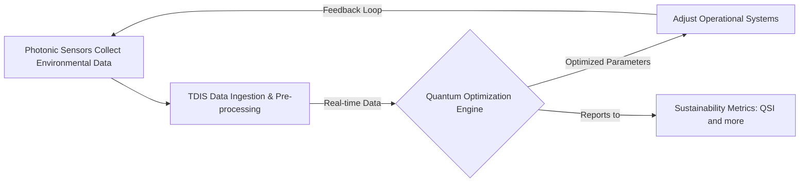

# GAIA-QAO Framework Overview

## Vision & Core Principles

GAIA-QAO pioneers the fusion of **quantum computing** and aerospace engineering to develop self-optimizing, climate-positive air and space transport systems.

### Key Principles
- **Trustworthy autonomy**: Human-readable, explainable AI decisions.
- **Planetary stewardship**: Carbon-negative operations via quantum optimization.
- **Cosmic democratization**: Open-source collaboration for global space exploration.

## Key Technical Concepts

### Entangled Accountability Protocol (QEG)

#### Overview
The Quantum Ethical Governance (QEG) framework ensures every autonomous decision is quantum-auditable and human-verifiable.

#### Components
- **TDIS Node**: Entangled ledger of decision qubits.
- **QuantumCircuit**: AGAD-standard audit logic.
- **ETH_hash()**: Quantum-resistant hash primitive.

#### Conceptual Python Implementation

```python
# Example: Quantum audit interface (see full repo for integration)
def quantum_audit_verify(decision_matrix, sdk="qiskit"):
    ...
```

---

## Reference System Structure

```plaintext
GAIA-QAO-Reference/
├── quantum_audit/
├── cpp_control/
├── rust_control/
└── tests/
```

---

## Example: Process Flow (Mermaid Diagram)



---

## Technical Metrics

| Parameter                 | Value         |
|---------------------------|--------------|
| Wavelength Range          | 400–700 nm   |
| Quantum Efficiency (peak) | ≥ 85 %       |
| Aperture Diameter         | 10 cm        |
| Detector Noise            | < 5 e¯ RMS   |
| Sampling Rate             | 1 kHz        |

---

## Build & Test Instructions

### Python
```sh
cd quantum_audit
python3 -m venv venv
source venv/bin/activate
pip install -r requirements.txt
```

### C++
```sh
cd cpp_control
mkdir -p build && cd build
cmake ..
make
PYTHONPATH=../../quantum_audit ./main
```

### Rust
```sh
cd rust_control
PYTHONPATH=../quantum_audit cargo run
```

### Tests
```sh
cd tests
bash test_cpp.sh
bash test_rust.sh
bash test_python.sh
```

---

## Notes
- Swap `"qiskit"` for `"cirq"` or `"tdis"` in Python audit calls as needed.
- All logs are structured (JSON).
- Bus stubs (ARINC429) are extensible for real hardware.

---
