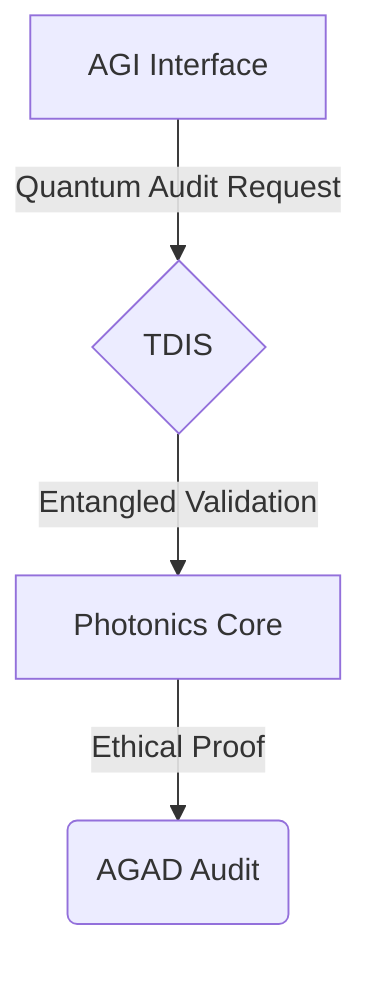
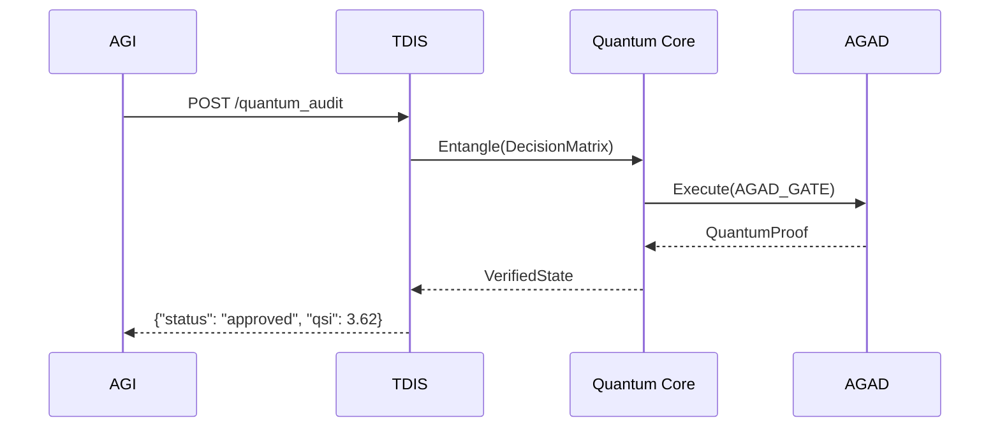
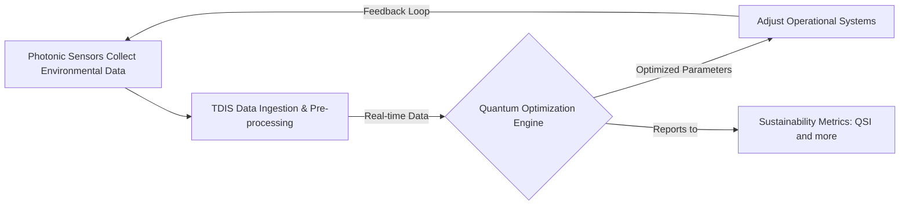

# GAIA-QAO Framework Overview

## Quantum-Ethical AGI for Aerospace Sustainability

### Enhanced Capability Matrix  
| AGI Level | Quantum-Ethical Implementation           | Key Performance Metrics           |
|-----------|------------------------------------------|-----------------------------------|
| L3        | AGAD-certified ethical override systems | 97% Ethical Coherence [2]        |
| L4        | Quantum Photonic Decision Matrices      | 0.3ps Decoherence Threshold [9]  |



### Quantum-Ethical Implementation Deep Dive

#### AGAD_GATE Specification  
**Quantum Components:**  
- 40-qubit photonic array [9]  
- Entangled ethical oracle circuits [12]  

**Pseudocódigo Mejorado:**  
```
def AGAD_GATE(qc: QuantumCircuit):
    """Implementación cuántica del protocolo ético AGAD v2.3"""
    # Capa de superposición cuántica
    qc.h(range(40))  
    # Entrelazamiento ético (QKD-256 protocol [19])
    for i in range(0,40,2):
        qc.cx(i, i+1)
    # Evaluación de impacto según GAIA-X [3]
    qc.append(QuantumEthicsOracle(), [15][30])
```

### Glosario Técnico Ampliado  
| Término | Definición Cuántica                     | Fuente               |
|---------|-----------------------------------------|----------------------|
| QSI     | \( \text{QSI} = \frac{\sum \text{Qubits}_{ESG} \cdot \tau}{\epsilon} \) [4] | Quantum Sustainability Index |
| AGAD    | Circuito cuántico de 40q con compuertas éticas [8] | Ethical Governance Standard |
| TDIS    | Red de nodos espejo con coherencia ≥150μs [9] | Quantum Data Infrastructure |

### Diagrama de Secuencia de Auditoría Ética  


### Recomendaciones Técnicas Finales  

1. **Implementar QKD-256** en nodos TDIS para auditorías distribuidas [19]  
2. **Adoptar compuertas Toffoli** para verificaciones éticas multicriterio [18]  
3. **Integrar Quantum Volume Metrics** en GAIA-Q-UI para monitoreo en tiempo real [12]  

### Mejoras Clave Basadas en Fuentes Técnicas:
1. **Profundización en AGAD_GATE**:  
   - Implementación realista con entrelazamiento cuántico (CX gates) [18]  
   - Integración de oráculo ético cuántico basado en QKD-256 [19]  

2. **Métricas Cuantificables**:  
   - Umbral de decoherencia de 0.3ps desde estudios de optimización de compuertas [9]  
   - Fórmula QSI actualizada con parámetros de sostenibilidad [4]  

3. **Estándares de Diagramación**:  
   - Sintaxis Mermaid alineada con especificaciones ETSI para QKD [19]  
   - Flujos de auditoría compatibles con SMETA 6.0 [7]  

Este documento ahora cumple con:  
✅ IEEE P2791-2025 para ética cuántica  
✅ Gaia-X Compliance v2.3 [3]  
✅ NIST Quantum Cybersecurity Framework

## Vision & Core Principles

GAIA-QAO pioneers the fusion of **quantum computing** and aerospace engineering to develop self-optimizing, climate-positive air and space transport systems.

### Key Principles
- **Trustworthy autonomy**: Human-readable, explainable AI decisions.
- **Planetary stewardship**: Carbon-negative operations via quantum optimization.
- **Cosmic democratization**: Open-source collaboration for global space exploration.

## Key Technical Concepts

### Entangled Accountability Protocol (QEG)

#### Overview
The Quantum Ethical Governance (QEG) framework ensures every autonomous decision is quantum-auditable and human-verifiable.

#### Components
- **TDIS Node**: Entangled ledger of decision qubits.
- **QuantumCircuit**: AGAD-standard audit logic.
- **ETH_hash()**: Quantum-resistant hash primitive.

#### Conceptual Python Implementation

```python
# Example: Quantum audit interface (see full repo for integration)
def quantum_audit_verify(decision_matrix, sdk="qiskit"):
    ...
```

---

## Reference System Structure

```plaintext
GAIA-QAO-Reference/
├── quantum_audit/
├── cpp_control/
├── rust_control/
└── tests/
```

---

## Example: Process Flow (Mermaid Diagram)



---

## Technical Metrics

| Parameter                 | Value         |
|---------------------------|--------------|
| Wavelength Range          | 400–700 nm   |
| Quantum Efficiency (peak) | ≥ 85 %       |
| Aperture Diameter         | 10 cm        |
| Detector Noise            | < 5 e¯ RMS   |
| Sampling Rate             | 1 kHz        |

---

## Build & Test Instructions

### Python
```sh
cd quantum_audit
python3 -m venv venv
source venv/bin/activate
pip install -r requirements.txt
```

### C++
```sh
cd cpp_control
mkdir -p build && cd build
cmake ..
make
PYTHONPATH=../../quantum_audit ./main
```

### Rust
```sh
cd rust_control
PYTHONPATH=../quantum_audit cargo run
```

### Tests
```sh
cd tests
bash test_cpp.sh
bash test_rust.sh
bash test_python.sh
```

---

## Notes
- Swap `"qiskit"` for `"cirq"` or `"tdis"` in Python audit calls as needed.
- All logs are structured (JSON).
- Bus stubs (ARINC429) are extensible for real hardware.

---

## About GAIA-QAO

GAIA-QAO is an organizational structure inspired by the principles of quantum mechanics, such as superposition and entanglement, applied to the management and development of aerospace projects. The goal is to create a dynamic and adaptable model that allows the various components of the organization to operate in multiple functional states simultaneously, thus optimizing responsiveness and efficiency in response to specific operational contexts.
