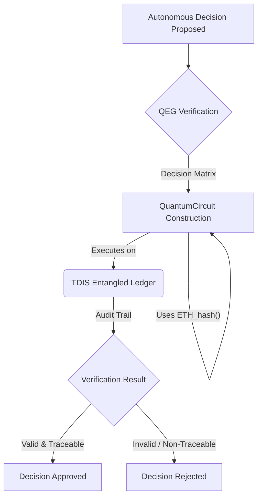
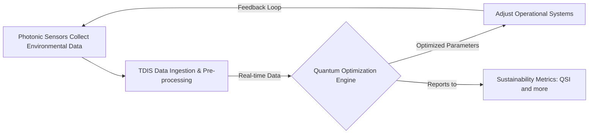

# GAIA-QAO Framework Overview

## Vision & Core Principles

GAIA-QAO pioneers the fusion of **quantum computing** and aerospace engineering to develop **self-optimizing**, **climate-positive** air and space transport systems. By embedding ethical AI and real-time environmental accountability via the Technical Data Information System (TDIS), we enable:
- **Trustworthy autonomy**: Systems that explain decisions in human-readable formats.
- **Planetary stewardship**: Carbon-negative operations through quantum route optimization and atmospheric data fusion.
- **Cosmic democratization**: Open-source tools to empower global collaboration on space exploration.

## Key Technical Concepts

### Entangled Accountability Protocol (QEG)

**Overview:**
The Quantum Ethical Governance (QEG) framework ensures every autonomous decision is quantum-auditable and human-verifiable. It combines a 3-layer approval stack with on-chain quantum hashes recorded in TDIS.

**Key Components:**
*   **TDIS Node:** Maintains an entangled ledger of decision qubits.
*   **QuantumCircuit:** Encodes audit logic based on AGAD (Auditable Governance and Algorithmic-Decisioning) standards.
*   **ETH_hash():** A conceptual quantum-resistant hash primitive for immutability within the QEG context.

**Conceptual Python Implementation:**
```python
from typing import List
# Assuming TDISNode, QuantumCircuit, and ETH_hash are defined
# within the GAIA-QAO quantum libraries.

class QuantumAudit:
    def __init__(self, qubits: int = 40):
        # Initialize a TDIS mirror node with N entangled qubits
        self.node = TDISNode(num_qubits=qubits) # Placeholder for TDIS SDK
        self.eth_hasher = ETH_hash() # Placeholder for hashing primitive

    def verify(self, decision_matrix: List[List[float]]) -> bool:
        # qc = QuantumCircuit(self.node.qubits) # Placeholder
        # qc.append(self.eth_hasher, qubits=range(self.node.qubits)) # Conceptual
        # qc.add_layers(decision_matrix) # Conceptual: apply decision logic
        # result = self.node.execute(qc) # Placeholder
        # return result.is_valid() and result.traceable() # Placeholder
        print(f"Verifying decision_matrix on {self.node.qubits} qubits via TDIS.")
        # Mock verification for demonstration
        return hash(str(decision_matrix)) % 2 == 0
```

**Mermaid Diagram (Conceptual Flow):**


### Photonic Sustainability Loop

**Concept:**
A closed-loop system that captures environmental data via photonic sensors, feeds it into quantum optimizers (managed by TDIS), and then adjusts operational parameters in real-time to minimize environmental impact and maximize efficiency.

**Energy Optimization Equation (Conceptual):**
The efficiency gain or energy optimization (ΔE) can be conceptualized as a function of photon energy, qubit coherence, and computational photonic efficiency:
$$
\Delta E \propto \hbar \omega \cdot \tau_{coherence} \cdot CPM
$$

Where:
- $\hbar \omega$: Photon energy
- $\tau_{coherence}$: Qubit coherence time (s)
- CPM: Computational Photonic Mile (a metric for energy cost per computational work over photonic links)

**Process Flow:**


**Implementation Notes:**
- Photonic sensors (e.g., LIDAR on QEPs) operate at specific wavelengths (e.g., 532 nm dual-polarization).
- Data is ingested by TDIS (target: v2.3 API) with low latency (target: <1 ms).
- Quantum optimizer utilizes solvers (e.g., QUBO) to minimize emissions footprint or optimize routes.

### QEP Optical Design

**Objective:**
Define the optical throughput $F_{sensor}$ for the Quantum Environmental Probe (QEP) to ensure high-fidelity data capture.

**Sensor Throughput (Conceptual Formula):**
The sensor's light gathering and conversion efficiency can be represented as:
$$
F_{sensor} = A \cdot \Omega \cdot \int_{\lambda_1}^{\lambda_2} T(\lambda) \cdot QE(\lambda) d\lambda
$$

Where:
- $A$: Aperture Area
- $\Omega$: Solid Angle of View
- $T(\lambda)$: Optical Transmission efficiency at wavelength $\lambda$
- $QE(\lambda)$: Quantum Efficiency of the detector at wavelength $\lambda$
- $\lambda_1, \lambda_2$: Operational wavelength range (e.g., 400–700 nm)

**Target Technical Specs:**
| Parameter | Value |
|---------------------------|-----------------|
| Wavelength Range | 400–700 nm |
| Quantum Efficiency (peak) | ≥ 85 % |
| Aperture Diameter | 10 cm |
| Detector Noise | < 5 e¯ RMS |
| Sampling Rate | 1 kHz |
