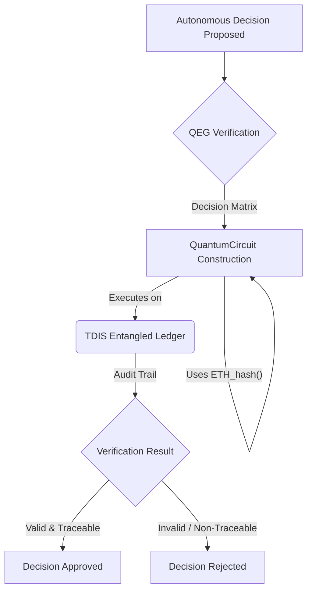

# Entangled Accountability Protocol (QEG)

## Overview

The Quantum Ethical Governance (QEG) framework ensures every autonomous decision is quantum-auditable and human-verifiable. It combines a 3-layer approval stack with on-chain quantum hashes recorded in TDIS.

## Key Components

* **TDIS Node:** Maintains an entangled ledger of decision qubits.
* **QuantumCircuit:** Encodes audit logic based on AGAD (Auditable Governance and Algorithmic-Decisioning) standards.
* **ETH_hash():** A conceptual quantum-resistant hash primitive for immutability within the QEG context.

## Conceptual Python Implementation

```python
from typing import List
# Assuming TDISNode, QuantumCircuit, and ETH_hash are defined
# within the GAIA-QAO quantum libraries.

class QuantumAudit:
    def __init__(self, qubits: int = 40):
        # Initialize a TDIS mirror node with N entangled qubits
        self.node = TDISNode(num_qubits=qubits) # Placeholder for TDIS SDK
        self.eth_hasher = ETH_hash() # Placeholder for hashing primitive

    def verify(self, decision_matrix: List[List[float]]) -> bool:
        # qc = QuantumCircuit(self.node.qubits) # Placeholder
        # qc.append(self.eth_hasher, qubits=range(self.node.qubits)) # Conceptual
        # qc.add_layers(decision_matrix) # Conceptual: apply decision logic
        # result = self.node.execute(qc) # Placeholder
        # return result.is_valid() and result.traceable() # Placeholder
        print(f"Verifying decision_matrix on {self.node.qubits} qubits via TDIS.")
        # Mock verification for demonstration
        return hash(str(decision_matrix)) % 2 == 0
```

## Mermaid Diagram (Conceptual Flow)



## About GAIA-QAO

GAIA-QAO is an organizational structure inspired by the principles of quantum mechanics, such as superposition and entanglement, applied to the management and development of aerospace projects. The goal is to create a dynamic and adaptable model that allows the various components of the organization to operate in multiple functional states simultaneously, thus optimizing responsiveness and efficiency in response to specific operational contexts.
