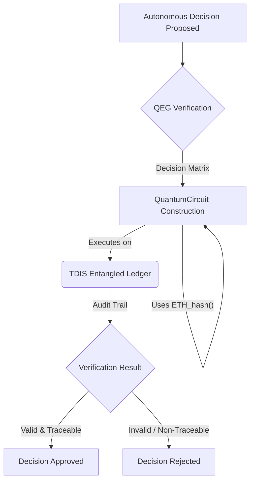

# Appendix B: Diagrams

## Entangled Accountability Protocol (QEG) Diagram



## Photonic Sustainability Loop Diagram

```mermaid
graph LR
    A[1. Photonic Sensors Collect Environmental Data] --> B(2. TDIS Data Ingestion & Pre-processing);
    B -- Real-time Data --> C{3. Quantum Optimization Engine};
    C -- Optimized Parameters --> D[4. Adjust Operational Systems];
    D -- Feedback Loop --> A;
    C -- Reports to --> E[5. Sustainability Metrics (e.g., QSI)];
```
