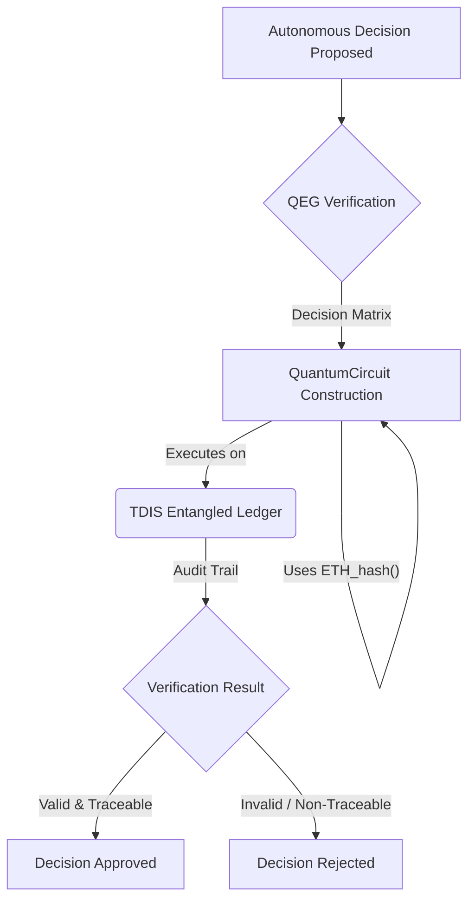
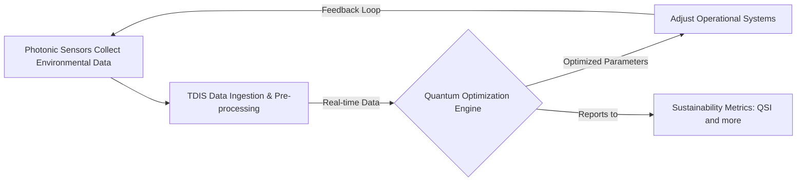

# GAIA-QAO Main Portal

**Aligning Aerospace Innovation with Quantum-Ethical Principles**

Welcome to the GAIA-QAO documentation hub! This repository contains the foundational documentation, specifications, and tools for the GAIA-QAO initiative, aiming to pioneer sustainable, safe, and explainable air and space transport systems through the convergence of quantum computing and aerospace engineering.

---

## 📜 Table of Contents

- [🌐 Vision & Core Principles](#-vision--core-principles)
- [🔑 Key Technical Concepts](#-key-technical-concepts)
    - [🛡️ Entangled Accountability Protocol (QEG)](#️-entangled-accountability-protocol-qeg)
    - [♻️ Photonic Sustainability Loop](#️-photonic-sustainability-loop)
    - [💡 QEP Optical Design](#-qep-optical-design)
- [⚙️ Phase 1 Implementation Roadmap (2025-2027)](#️-phase-1-implementation-roadmap-2025-2027)
- [🔬 QSI Interactive Calculator](#-qsi-interactive-calculator)
- [🗂️ Repository Structure](#️-repository-structure)
- [🤝 Contributing](#-contributing)
- [📄 License](#-license)
- [🔗 Quick Links to Documentation Sections](#-quick-links-to-documentation-sections)

---

## 🌐 Vision & Core Principles

GAIA-QAO pioneers the fusion of **quantum computing** and aerospace engineering to develop **self-optimizing**, **climate-positive** air and space transport systems. By embedding ethical AI and real-time environmental accountability via the Technical Data Information System (TDIS), we enable:
- **Trustworthy autonomy**: Systems that explain decisions in human-readable formats.
- **Planetary stewardship**: Carbon-negative operations through quantum route optimization and atmospheric data fusion.
- **Cosmic democratization**: Open-source tools to empower global collaboration on space exploration.

For a detailed overview, please see [Part 0: Framework Overview](./00_Framework_Overview.md).

---

## 🔑 Key Technical Concepts

### 🛡️ Entangled Accountability Protocol (QEG)

**Overview:**
The Quantum Ethical Governance (QEG) framework ensures every autonomous decision is quantum-auditable and human-verifiable. It combines a 3-layer approval stack with on-chain quantum hashes recorded in TDIS.

**Key Components:**
*   **TDIS Node:** Maintains an entangled ledger of decision qubits.
*   **QuantumCircuit:** Encodes audit logic based on AGAD (Auditable Governance and Algorithmic-Decisioning) standards.
*   **ETH_hash():** A conceptual quantum-resistant hash primitive for immutability within the QEG context.

**Conceptual Python Implementation:**
```python
from typing import List
# Assuming TDISNode, QuantumCircuit, and ETH_hash are defined
# within the GAIA-QAO quantum libraries.

class QuantumAudit:
    def __init__(self, qubits: int = 40):
        # Initialize a TDIS mirror node with N entangled qubits
        self.node = TDISNode(num_qubits=qubits) # Placeholder for TDIS SDK
        self.eth_hasher = ETH_hash() # Placeholder for hashing primitive

    def verify(self, decision_matrix: List[List[float]]) -> bool:
        # qc = QuantumCircuit(self.node.qubits) # Placeholder
        # qc.append(self.eth_hasher, qubits=range(self.node.qubits)) # Conceptual
        # qc.add_layers(decision_matrix) # Conceptual: apply decision logic
        # result = self.node.execute(qc) # Placeholder
        # return result.is_valid() and result.traceable() # Placeholder
        print(f"Verifying decision_matrix on {self.node.qubits} qubits via TDIS.")
        # Mock verification for demonstration
        return hash(str(decision_matrix)) % 2 == 0
```

**Mermaid Diagram (Conceptual Flow):**


### ♻️ Photonic Sustainability Loop

**Concept:**
A closed-loop system that captures environmental data via photonic sensors, feeds it into quantum optimizers (managed by TDIS), and then adjusts operational parameters in real-time to minimize environmental impact and maximize efficiency.

**Energy Optimization Equation (Conceptual):**
The efficiency gain or energy optimization (ΔE) can be conceptualized as a function of photon energy, qubit coherence, and computational photonic efficiency:
$$
\Delta E \propto \hbar \omega \cdot \tau_{coherence} \cdot CPM
$$

Where:
- $\hbar \omega$: Photon energy
- $\tau_{coherence}$: Qubit coherence time (s)
- CPM: Computational Photonic Mile (a metric for energy cost per computational work over photonic links)

**Process Flow:**


**Implementation Notes:**
- Photonic sensors (e.g., LIDAR on QEPs) operate at specific wavelengths (e.g., 532 nm dual-polarization).
- Data is ingested by TDIS (target: v2.3 API) with low latency (target: <1 ms).
- Quantum optimizer utilizes solvers (e.g., QUBO) to minimize emissions footprint or optimize routes.

### 💡 QEP Optical Design

**Objective:**
Define the optical throughput $F_{sensor}$ for the Quantum Environmental Probe (QEP) to ensure high-fidelity data capture.

**Sensor Throughput (Conceptual Formula):**
The sensor's light gathering and conversion efficiency can be represented as:
$$
F_{sensor} = A \cdot \Omega \cdot \int_{\lambda_1}^{\lambda_2} T(\lambda) \cdot QE(\lambda) d\lambda
$$

Where:
- $A$: Aperture Area
- $\Omega$: Solid Angle of View
- $T(\lambda)$: Optical Transmission efficiency at wavelength $\lambda$
- $QE(\lambda)$: Quantum Efficiency of the detector at wavelength $\lambda$
- $\lambda_1, $\lambda_2$: Operational wavelength range (e.g., 400–700 nm)

**Target Technical Specs:**
| Parameter | Value |
|---------------------------|-----------------|
| Wavelength Range | 400–700 nm |
| Quantum Efficiency (peak) | ≥ 85 % |
| Aperture Diameter | 10 cm |
| Detector Noise | < 5 e¯ RMS |
| Sampling Rate | 1 kHz |

---

## ⚙️ Phase 1 Implementation Roadmap (2025-2027)

A two-year plan to deploy core GAIA-QAO infrastructure, primarily focused on the Madrid pilot.

| Milestone | Target Date | Owner | Key Deliverables |
|---------------------------|-----------------|-----------------|-----------------|
| TDIS Mirror Node Deployment | Q3 2025 | Infra Team | 6 × 40-qubit (simulated/emulated or early hardware) nodes operational |
| 6G Quantum-Resistant Mesh Testbed | Q1 2026 | Comms Team | Proof-of-concept 1.2 Tbps (target) mesh, 128-QAM OFDM capability |
| QEP Photonic Sensor Rollout | Q2 2026 | Enviro Team | 20 scooter-mounted LIDAR/photonic sensor units deployed |
| Quantum Audit Protocol Alpha | Q4 2026 | QEG Team | v0.1 of QEG audit SDK, initial AGAD compliance report |
| QSI Public Dashboard Beta | Q2 2027 | Data Team | Live (simulated) QSI metrics, preliminary user API access |
| Full Pilot Evaluation Report | Q4 2027 | Steering Council | Environmental impact report, next-phase proposal |

---

## 🔬 QSI Interactive Calculator

The Quantum Sustainability Index (QSI) calculator lets you explore how the number of qubits dedicated to Environmental, Social, and Governance (ESG) tasks and their coherence time might affect a system’s conceptual sustainability score.

$$
QSI = \frac{\sum (\text{Qubits Committed to ESG}) \times \text{Coherence Time}}{\text{Entropic Footprint Constant}} + \text{Human Flourishing Factor (proxy)}
$$

Below are two reference implementations: one in Streamlit (Python) and one as a React component.

### 1. Streamlit (Python)

Create a file named `qsi_calculator.py`:
```python
import streamlit as st
import random

st.title("Quantum Sustainability Index (QSI) Calculator")
st.caption("Conceptual model for GAIA-QAO")

qubits = st.slider("Effective ESG Qubits", min_value=1, max_value=100, value=40,
                   help="Number of qubits effectively contributing to ESG optimization.")
tau_micro_sec = st.number_input("Coherence time (μs)", min_value=1.0, value=150.0, step=10.0, format="%.1f",
                                help="Average coherence time of the ESG qubits in microseconds.")
tau = tau_micro_sec * 1e-6 # convert to seconds

# Constants (conceptual for this model)
BASE_ENTROPIC_FOOTPRINT = 1.67  # Arbitrary units (e.g., J/photon-mile equivalent)
HFF_MIN = 0.85 # Human Flourishing Factor proxy min
HFF_MAX = 0.95 # Human Flourishing Factor proxy max

def calculate_qsi(qubits: int, tau_seconds: float) -> float:
    # Add a small pseudo-random element to represent the Human Flourishing Factor proxy
    human_flourishing_proxy = random.uniform(HFF_MIN, HFF_MAX)
    if BASE_ENTROPIC_FOOTPRINT == 0: return 0 # Avoid division by zero
    return (qubits * tau_seconds) / BASE_ENTROPIC_FOOTPRINT + human_flourishing_proxy

qsi = calculate_qsi(qubits, tau)

st.metric(label="Calculated QSI", value=f"{qsi:.2f}")

st.markdown("""
**Note:** This calculator is a simplified conceptual model.
- **ESG Qubits:** Represents quantum resources dedicated to sustainability tasks.
- **Coherence Time:** A key factor in quantum computational power.
- **Entropic Footprint Constant:** A placeholder for the system's baseline environmental impact.
- **Human Flourishing Factor (proxy):** A randomized placeholder for complex societal benefits.
""")
```

Run the app:
```bash
pip install streamlit
streamlit run qsi_calculator.py
```

### 2. React (JavaScript/JSX)

Create a file named `QsiCalculator.jsx` (assumes Ant Design for UI components):
```jsx
import React, { useState, useEffect } from 'react';
import { Slider, InputNumber, Card, Typography, Tooltip } from 'antd';
import { QuestionCircleOutlined } from '@ant-design/icons';

const { Title, Text, Paragraph } = Typography;

export default function QsiCalculator() {
  const [qubits, setQubits] = useState(40);
  const [tauMicroSec, setTauMicroSec] = useState(150); // Coherence time in microseconds
  const [qsi, setQsi] = useState(0);

  const BASE_ENTROPIC_FOOTPRINT = 1.67; // Arbitrary units
  const HFF_MIN = 0.85;
  const HFF_MAX = 0.95;

  useEffect(() => {
    const tauSeconds = tauMicroSec * 1e-6;
    const humanFlourishingProxy = Math.random() * (HFF_MAX - HFF_MIN) + HFF_MIN;
    let calculatedQsi = 0;
    if (BASE_ENTROPIC_FOOTPRINT !== 0) {
        calculatedQsi = (qubits * tauSeconds) / BASE_ENTROPIC_FOOTPRINT + humanFlourishingProxy;
    }
    setQsi(calculatedQsi.toFixed(2));
  }, [qubits, tauMicroSec]);

  return (
    <Card title={<Title level={4}>Quantum Sustainability Index (QSI) Calculator</Title>} style={{ maxWidth: 500, margin: 'auto' }}>
      <Paragraph type="secondary">Conceptual model for GAIA-QAO.</Paragraph>
      <div style={{ marginBottom: 20 }}>
        <Text>
            Effective ESG Qubits{' '}
            <Tooltip title="Number of qubits effectively contributing to ESG optimization.">
                <QuestionCircleOutlined />
            </Tooltip>
        : {qubits}</Text>
        <Slider min={1} max={100} value={qubits} onChange={setQubits} />
      </div>
      <div style={{ marginBottom: 20 }}>
        <Text>
            Coherence time (μs){' '}
            <Tooltip title="Average coherence time of the ESG qubits in microseconds.">
                <QuestionCircleOutlined />
            </Tooltip>
        :</Text>
        <InputNumber
            min={1.0}
            step={10.0}
            value={tauMicroSec}
            onChange={value => setTauMicroSec(value || 0)}
            style={{ width: '100%' }}
            formatter={value => `${value} μs`}
            parser={value => value ? value.replace(' μs', '') : ''}
        />
      </div>
      <Title level={3}>QSI: {qsi}</Title>
      <Paragraph type="secondary" style={{ fontSize: '0.8em', marginTop: 16 }}>
        <strong>Note:</strong> This calculator is a simplified conceptual model.
        The QSI attempts to quantify sustainability by factoring in quantum computational power dedicated to ESG goals against a baseline environmental impact, plus a proxy for broader societal benefits.
      </Paragraph>
    </Card>
  );
}
```

To use this component, import and render `<QsiCalculator />` in your React application (ensure `antd` is installed).

---

## 🗂️ Repository Structure

This repository is organized as follows:
- `00_Framework_Overview.md`: The main conceptual document outlining the GAIA-QAO vision and principles.
- `01_Software_Technologies.md` to `09_Implementation_Guidelines.md`: Detailed "Parts" covering specific aspects of the GAIA-QAO framework.
- `Appendix_A_ST_Codes.md` to `Appendix_G_Templates.md`: Appendices containing supporting materials like codes, examples, diagrams, and templates.
- `generate_master_document.sh`: A script to concatenate individual Markdown files into a master document.
- `README.md`: This file, providing an overview of the repository and project.
- Potentially other scripts, configuration files, or source code for tools like the QSI calculator.

The documentation follows the Aerospace General Index (AGI) structure, with TDIS (Technical Data Information System) as the central pillar for managing metadata, versions, and interlinks.

---

## 🤝 Contributing

We welcome contributions to the GAIA-QAO project! If you're interested in contributing, please:
1. Review the Part 0: Framework Overview to understand the project's vision and guiding principles.
2. Check the Issues tab for areas where help is needed.
3. Fork the repository.
4. Create a new branch for your feature or bug fix.
5. Make your changes and commit them with clear, descriptive messages.
6. Push your branch and open a Pull Request.

Please ensure your contributions align with the project's ethical and sustainability goals. Adherence to AGAD and COAFI standards, where applicable, is encouraged.

---

## 📄 License

This project is licensed under the Apache License 2.0 (Assumption - please add a LICENSE file if you have a specific one).

The documentation and concepts herein represent a forward-looking vision and are subject to evolution.

---

## 🔗 Quick Links to Documentation Sections

- [Part 0: Framework Overview](./00_Framework_Overview.md)
- [Part 1: Software Technologies](./01_Software_Technologies.md)
- [Part 2: HIL Thinking](./02_HIL_Thinking.md)
- [Part 3: GQOIS Object ID](./03_GQOIS_Object_ID.md)
- [Part 4: Entangled Accountability Protocol](./04_Entangled_Accountability_Protocol.md)
- [Part 5: Photonic Sustainability Loop](./05_Photonic_Sustainability_Loop.md)
- [Part 6: QEP Optical Design](./06_QEP_Optical_Design.md)
- [Part 7: Phase 1 Implementation Roadmap](./07_Phase_1_Implementation_Roadmap.md)
- [Part 8: QSI Interactive Calculator](./08_QSI_Interactive_Calculator.md)
- [Part 9: Implementation Guidelines](./09_Implementation_Guidelines.md)
- [Appendix A: ST Codes](./Appendix_A_ST_Codes.md)
- [Appendix B: Diagrams](./Appendix_B_Diagrams.md)
- [Appendix C: Templates](./Appendix_C_Templates.md)

---

(Document version: GAIA-QAO README v1.0 - Last updated: YYYY-MM-DD)

(Derived from concepts in GAIA-QAO 2.3.1 – Certified by AGAD Ethics Board via TDIS on 2025-05-25)
