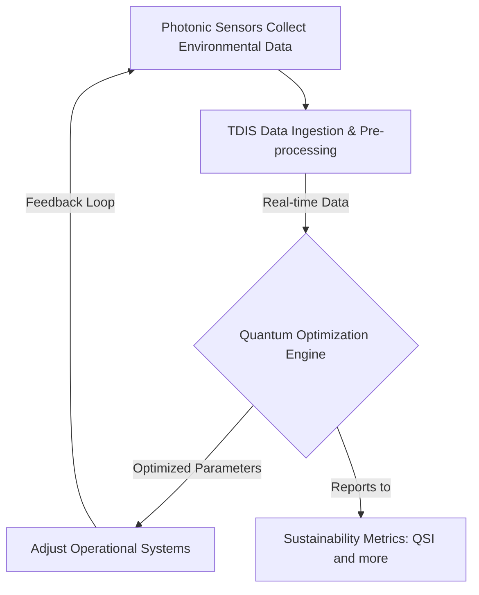

# GAIA-QAO Infographic

## Overview

This document provides a visual representation of the GAIA-QAO framework, highlighting the key components and their interactions. The infographic is designed to help stakeholders understand the structure and processes of the GAIA-QAO initiative.

## Infographic

The following infographic illustrates the GAIA-QAO flowchart:

## Key Components

### Photonic Sensors

Photonic sensors are used to capture environmental data in real-time. They operate at specific wavelengths and provide high-fidelity data that is fed into the quantum optimizers managed by TDIS.

### TDIS (Technical Data Information System)

TDIS is responsible for managing metadata, versions, and interlinks between various components of the system. It ensures real-time environmental accountability and supports the integration of ethical AI principles into the GAIA-QAO systems.

### Quantum Optimization Engine

The Quantum Optimization Engine leverages quantum algorithms to optimize various parameters in real-time. It uses the data collected by photonic sensors and processed by TDIS to make informed decisions that minimize environmental impact and maximize efficiency.

### Sustainability Metrics (QSI)

The Quantum Sustainability Index (QSI) is a computational metric that measures the impact of the GAIA-QAO systems on environmental, social, and governance (ESG) factors. It is optimized using AI and quantum computing to ensure the highest level of sustainability.

## Conclusion

The GAIA-QAO infographic provides a clear and concise visual representation of the key components and processes involved in the initiative. By understanding the interactions between these components, stakeholders can better appreciate the innovative approach of GAIA-QAO in developing sustainable, safe, and explainable air and space transport systems.
